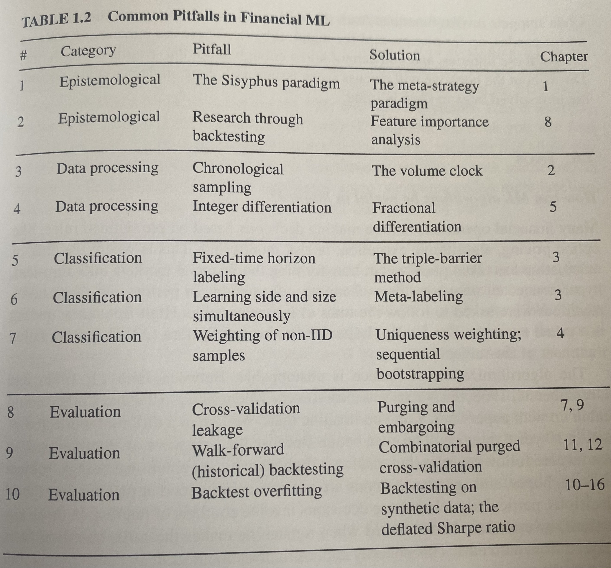

# Cryptocurrency Algorithmic Trading

This is a collection of notes for reference while I am building my architecture and trading bot.

## TASKS

- Create pandas dataframe from binance api data.

    - 

## Common Pitfalls and How to Fix Them

----

## Data

Things to keep in mind while collecting and processing data

- Don't sample chronololgically.
- Integer differentation.

## Meta-Strategies

Fit models on top of your primary model.

## Overfitting

